# Assignment 1 - Agile Software Practice.

__Name:__ Haoepeng Liang

This repository contains the implementation of a React App, its associated Cypress tests and the GitLab CI pipeline.

## React App Features.

The Movies Fan app now includes several new and enhanced features aimed at improving user engagement and experience:

+ **Dynamic Movie Carousel**: Showcases featured movies with engaging transition effects, enhancing the visual appeal.
  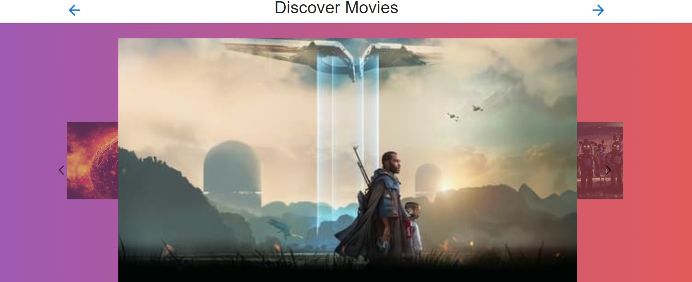

+ **Filtering and Sorting**: Allows users to filter movies and actors based on various criteria like genre, popularity, name, and sort them in ascending or descending order.
  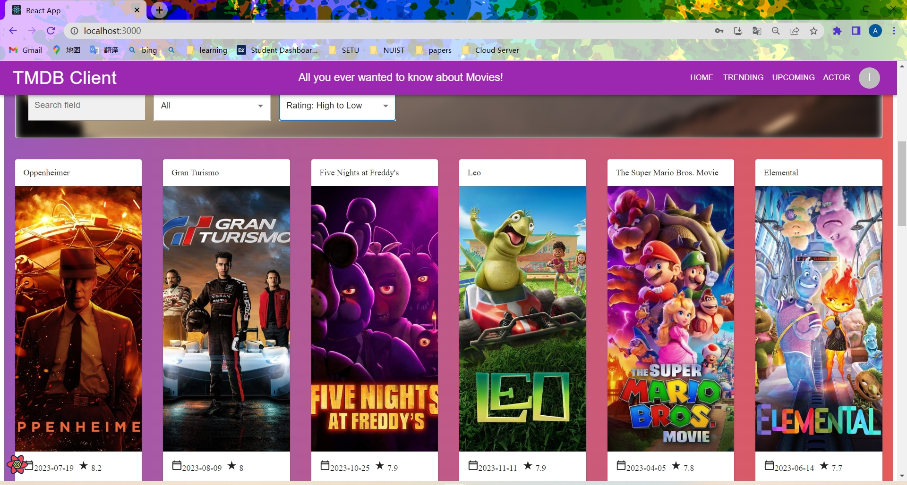

  
  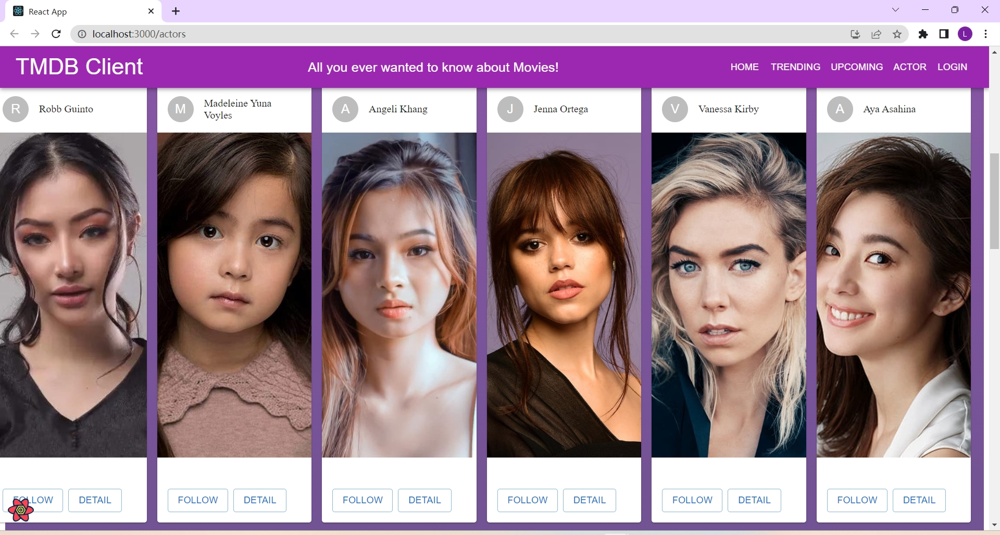

+ **Pagination**: Facilitates efficient navigation through movie and actor lists, improving user experience for extensive data.
  

+ **Actor Profiles**: Offers in-depth information about actors, including biographical details, filmography, and associated images.
  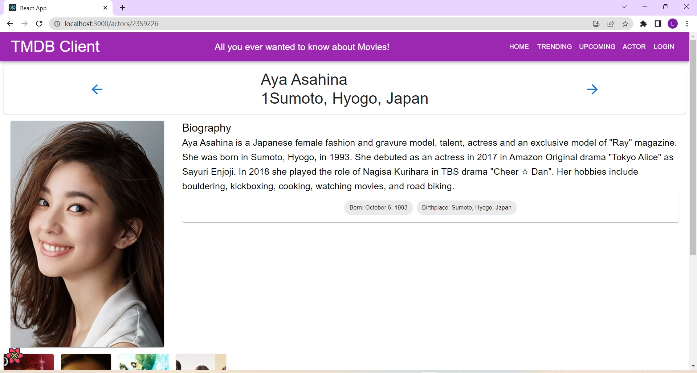

+ **Responsive Design**: Guarantees a seamless user experience across different devices and screen sizes.

+ **Firebase Authentication**: Incorporates user authentication features such as login, registration, and Google sign-in for enhanced security and personalized experience.
  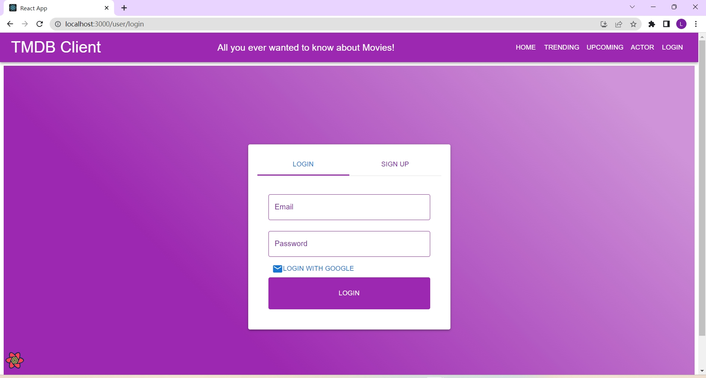
  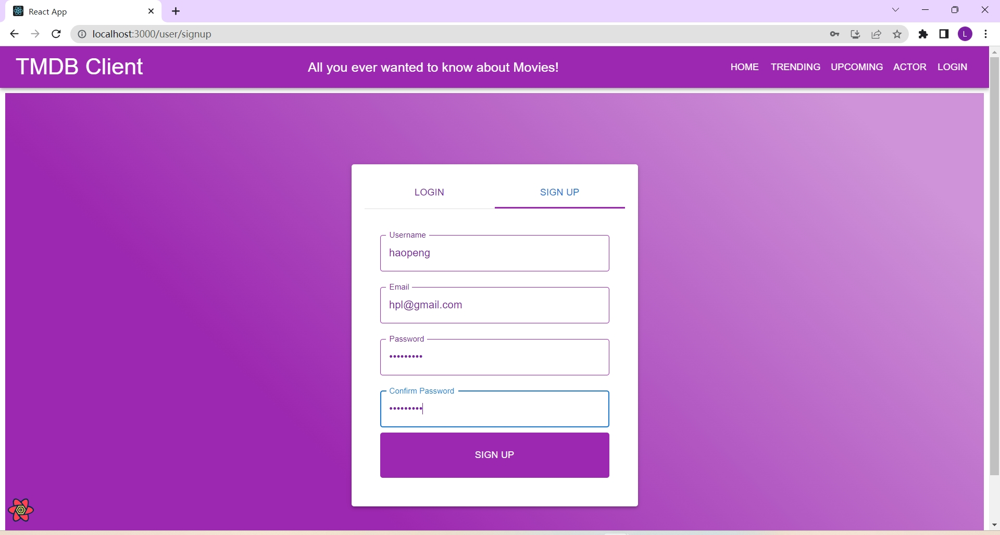
  

+ **Protected Routes**: Limits access to certain sections of the app exclusively to authenticated users, securing sensitive information.
  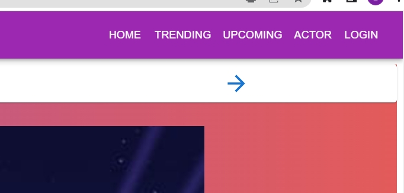
  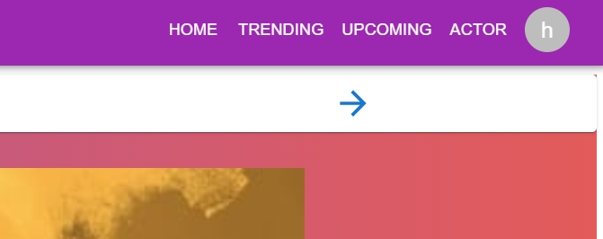
  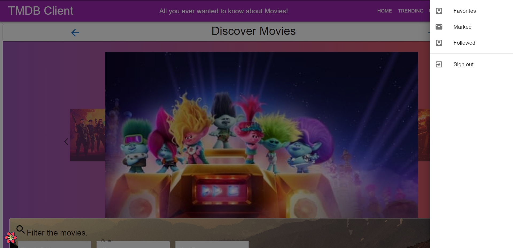

+ **Movie and Actor Credits**: Presents detailed credits for each movie, including cast and crew, and showcases the movie credits for actors, providing a comprehensive view of their work.
  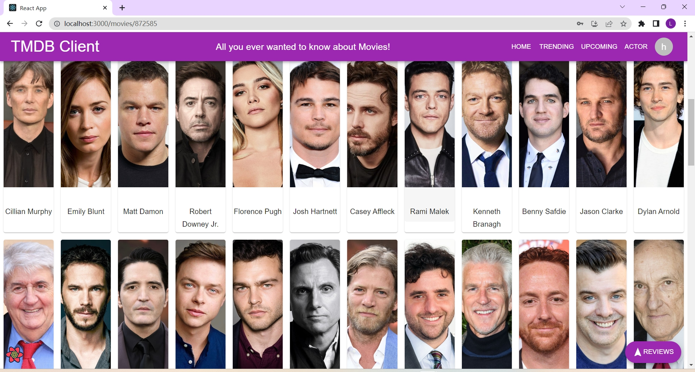
  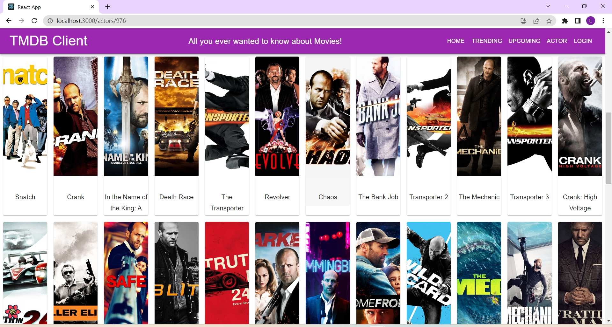

+ **Enhanced Actor Discovery**: Introduces features to discover actors, including options to view popular actors, their images, and filter or sort them by gender, popularity, and name.
  
  

+ **Improved Movie Discovery**: Enriches the experience of exploring movies with added functionality to view trending movies, upcoming releases, and filter them by release dates and ratings.
  

## Automated Tests.

1. **actorDetail.cy.js**: Tests the detailed information displayed for an actor, including biographical details, filmography, and associated images.
2. **actorPage.cy.js**: Validates the functionality and display of the actors' listing page, ensuring correct filtering and sorting options are available and functional.
3. **addToFollowed.cy.js**: Ensures that users can successfully add actors to their followed list, and verifies the list updates correctly.
4. **addToMarked.cy.js**: Checks the functionality of marking movies as favorites, including adding to the list and displaying on the user's favorites page.
5. **addTrendingFavorite.cy.js**: Focuses on the ability to add trending movies to the user’s favorite list and ensures these selections are reflected accurately.
6. **movieDetail.cy.js**: Tests the movie details page for displaying accurate information such as movie title, overview, genres, and cast.
7. **navigation.cy.js**: Verifies the navigation between different pages of the app, ensuring links and routing are functioning as expected.
8. **reviewsForm.cy.js**: Checks the functionality of the movie review submission form, including form validation and successful submission handling.
9. **trendingPage.cy.js**: Ensures that the trending movies page loads correctly and displays the correct list of trending movies.
10. **upcomingPage.cy.js**: Tests the upcoming movies page for correct display and functionality, including loading upcoming movies and displaying detailed information upon selection.

### Unique functionality testing (if relevant).

1. **Actor Profile Testing (actorDetail.cy.js)**: This test ensures that the actor profile page uniquely displays detailed biographical information and filmography, showcasing a comprehensive view of each actor's career.
2. **Actor Discovery and Management (addToFollowed.cy.js)**: Tests the unique functionality where users can discover actors and add them to their followed list, enhancing the personalized experience of the app.
3. **Movie Favoriting (addTrendingFavorite.cy.js and addToMarked.cy.js)**: Validates the feature that allows users to mark movies as their favorites, a unique aspect that personalizes user experience and provides easy access to preferred content.
4. **Dynamic Movie Detail Display (movieDetail.cy.js)**: Ensures that the movie detail page dynamically displays detailed information about each movie, including cast, crew, and genre, providing an enriched user interaction.
5. **User-Interactive Movie Reviews (reviewsForm.cy.js)**: This test covers the functionality where users can write and submit reviews for movies, a unique feature that fosters user engagement and community interaction within the app.

**Favorite Movie Tagging**: This feature allows users to tag movies as their favorites, which are then listed on a separate page for easy access and reference. The functionality is validated through the following test files:

- `cypress/e2e/addToMarked.cy.js`: Tests the capability of users to mark movies as “Marked”.
- `cypress/e2e/addTrendingFavorite.cy.js`: Ensures users can add trending movies to their favorites list.
- `cypress/e2e/addToFollowed.cy.js`: Provides users can add actors to their followed list.

**Movie and Actor Detailed Information Display**: Users can access detailed information pages for movies and actors. These pages display in-depth information including biographical details, filmography, and associated images. This feature is tested through:

- `cypress/e2e/movieDetail.cy.js`: Confirms that the movie details page correctly displays information such as the movie title, overview, genres, and cast.
- `cypress/e2e/actorDetail.cy.js`: Verifies that the actor details page accurately presents the actor's biographical information, filmography, and related images.

### Error/Exception testing (if relevant).

1. **Submit Review Form Directly (Empty Fields)**: This test validates the error handling when the review form is submitted without filling in any fields. It checks for error messages like "Name is required" and "Review cannot be empty," ensuring the form validation works correctly.
1. **Submit Review with Only Author Name**: This test case focuses on submitting the review form with only the author's name filled in and no review text. It ensures that the application correctly handles this scenario by displaying an error message like "Review cannot be empty."
1. **Submit Review with Author Name but Short Review Text**: In this test, the review form is submitted with a valid author's name but with a review text that is too short. It checks for an error message like "Review is too short," verifying the application's ability to enforce minimum length requirements for reviews.

### Cypress Custom commands (if relevant).

+ cypress/support/commands.js
+ cypress/e2e/actorDetail.cy.js
+ cypress/e2e/movieDetail.cy.js

## Code Splitting.

[Specify the pathname of each source code file that contains evidence of code splitting in your React app.]

e.g.
+ src/index.js
+ src/pages/actorDetailPage.js
+ src/pages/actorListPage.js
+ src/pages/addMovieReviewPage.js
+ src/pages/homePage.js
+ src/pages/markedMoviesPage.js
+ src/pages/moviesDetailPage.js
+ src/pages/trendingMoviesPage.js
+ src/pages/upcomingMoviesPage.js
+ src/components/templateMoviePage/index.js
+ src/components/templateActorPage/index.js

## Pull Requests.

https://github.com/Agcy/agile-spa-ca1

## Independent learning (If relevant).

1. **Automated UI Interaction Testing**: Developed advanced automated testing techniques using Cypress. This included scripting Cypress to simulate user interactions by clicking on the center area of the screen, a complex task that goes beyond basic automated tests. This approach helped in testing UI elements that are dynamically rendered or change position based on user interactions. Evidence of this work can be found in:
   - `cypress/e2e/addToFollowed.cy.js`
   - `cypress/e2e/reviewForm.cy.js`
   - `cypress/e2e/addToMarked.cy.js`
     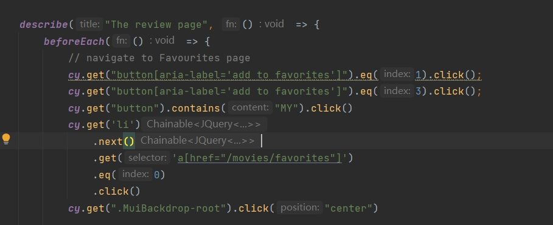
2. **Continuous Deployment with GitHub**: Implemented an automated deployment pipeline using GitHub Actions. This setup automatically deploys the latest version of the application to the production server upon each push to the master branch, ensuring a seamless and efficient deployment process. The configuration files for this setup can be found in the repository's `.github/workflows` directory.

​		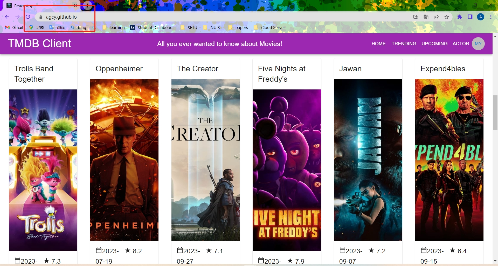
